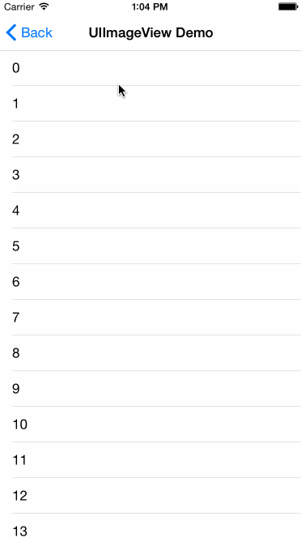
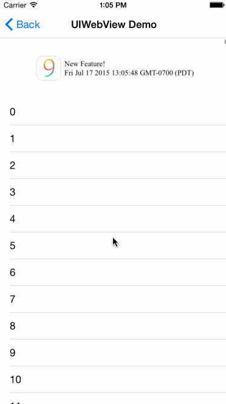
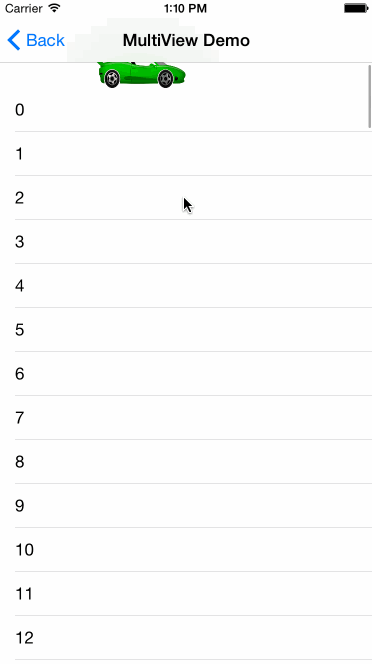

# NDRefresh

  

NDRefresh is a flexiable custom pull-to-refresh control for [UIScrollView](https://developer.apple.com/library/ios/documentation/UIKit/Reference/UIScrollView_Class/) of iOS apps. It's written in Swift, but it can be used in both Swift and Objective-C projects.

## Demo

NDRefresh displays whatever view you define. 

Here's a demo using UIImageView:

We discover that you get extremely flexible if you are using UIWebView, as you can push HTML/js/css snippets from your server side:

Of course, you can put multiple views together to get creative:

## Usage

### Swift

(*Please see [NDRefreshSwiftExample](https://github.com/Nextdoor/NDRefresh/tree/master/NDRefreshSwiftExample) for an example app using NDRefresh, written in Swift*)

Step 1: Declare an object property in your `UIViewController`:
	
    var refreshCtrl: NDRefreshControl?
	
Step 2: In `viewDidLoad()` of your `UIViewController`, initialize a `UIView` and register closures to `refreshCtrl`:

    // Create a view. Make sure you set up its frame
    let refreshView = MyAwesomeView(frame: ...)
    
    // scrollView could be any subclass of UIScrollView, e.g., UITableView
    var refreshCtrl = NDRefreshControl(refreshView: refreshView, scrollView: scrollView)
    refreshCtrl?.renderIdleClosure = renderIdleHandler
    refreshCtrl?.renderRefreshClosure = renderRefreshHandler
    refreshCtrl?.renderPullingClosure = renderPullingHandler
    refreshCtrl?.renderReadyForRefreshClosure = renderReadyForRefreshHandler 

Step 3: `viewDidAppear()` of your `UIViewController`:
    
    refreshCtrl?.configureForRefresh()
    
Step 4: Implement closures:

    // All closures have the same function signiture
    func renderIdleHandler(refreshControl: NDRefreshControl) {
        var refreshView = refreshControl.refreshView as! MyAwesomeView
            var scrollView = refreshControl.scrollView
        // Do something
    }

Optional step: Call this function whenever you want to programmatically pull to refresh: 

    refreshCtrl?.beginRefresh()
    
### Objective-C

(*Please see [NDRefreshObjcExample](https://github.com/Nextdoor/NDRefresh/tree/master/NDRefreshObjcExample) for an example app using NDRefresh, written in Objective-C*)

Step 1: Declare an object property in your `UIViewController`:
	
	@property (nonatomic, strong) NDRefreshControl *control;
	
Step 2: In `viewDidLoad()` of your `UIViewController`, initialize a `UIView` and register closures to `refreshCtrl`:

    // Create a view. Make sure you set up its frame
    MyAwesomeView *refreshView = [[MyAwesomeView alloc] initWithFrame ...]

    // scrollView could be any subclass of UIScrollView, e.g., UITableView    
    self.control = [[NDRefreshControl alloc] initWithRefreshView:refreshView scrollView:scrollView];
    self.control.renderIdleClosure = ^(NDRefreshControl *refreshControl) {

    };
    self.control.renderPullingClosure = ^(NDRefreshControl *refreshControl) {

    };
    self.control.renderReadyForRefreshClosure = ^(NDRefreshControl *refreshControl) {

    };
    self.control.renderRefreshClosure = ^(NDRefreshControl *refreshControl) {
        // This is to emulate expensive network request.
        dispatch_after(dispatch_time(DISPATCH_TIME_NOW, (int64_t)(2 * NSEC_PER_SEC)), dispatch_get_main_queue(), ^{
            [refreshControl endRefresh];
        });
    };

Step 3: `viewDidAppear()` of your `UIViewController`:
    
    [self.control configureForRefresh];

Optional step: Call this function whenever you want to programmatically pull to refresh: 

    [self.control beginRefresh];

## Installation

### Carthage

NDRefresh is available through [Carthage](https://github.com/Carthage/Carthage), to install it simply add the following line to your Cartfile:
    	
    github "Nextdoor/NDRefresh"

### Manual installation
Add the `NDRefresh/NDRefresh/NDRefreshControl.swift` into your project.

## Requirements
* Xcode 6.3+
* iOS 8.0+

## License

    The Apache License 2.0

    Copyright 2015 Nextdoor.com Inc.

    Licensed under the Apache License, Version 2.0 (the "License");
    you may not use this file except in compliance with the License.
    You may obtain a copy of the License at

        http://www.apache.org/licenses/LICENSE-2.0

    Unless required by applicable law or agreed to in writing, software
    distributed under the License is distributed on an "AS IS" BASIS,
    WITHOUT WARRANTIES OR CONDITIONS OF ANY KIND, either express or implied.
    See the License for the specific language governing permissions and
    limitations under the License.
